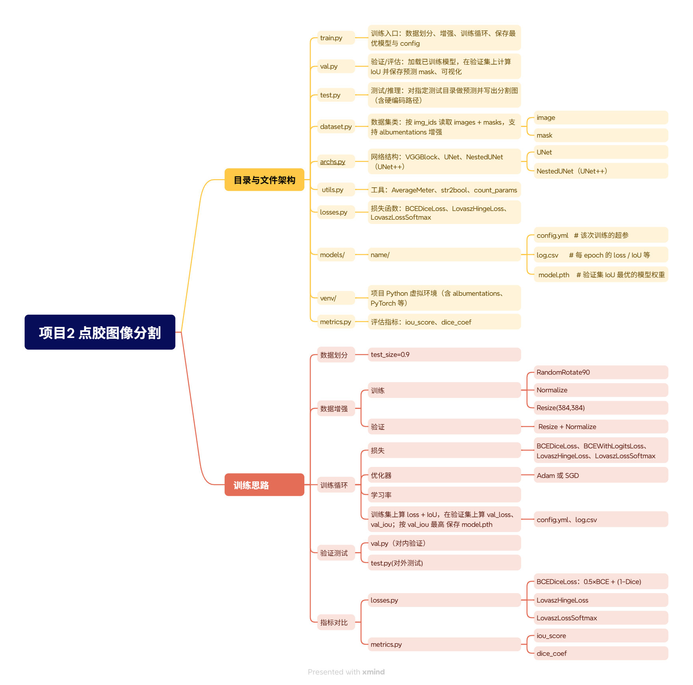

## 思维导图


# 点胶缺陷分割（UNet++ / NestedUNet）

本项目基于 **UNet++（NestedUNet）** 实现点胶区域/缺陷的语义分割，用于工业场景下对点胶质量进行自动检测。  
使用 **PyTorch + Albumentations** 实现，可扩展到其它类似的二值或多类分割任务。

---

## 特性

- 基于 **UNet / UNet++（NestedUNet）** 的编码器–解码器结构
- 支持多种损失函数：`BCEDiceLoss`、`LovaszHingeLoss`、`LovaszLossSoftmax` 等
- 使用 **Albumentations** 进行数据增强（旋转、翻转、亮度/对比度等）
- 自动记录训练日志（`log.csv`）和完整配置（`config.yml`）
- 按 **验证集 IoU 最优** 保存模型权重 `model.pth`
- 提供验证与测试脚本，支持可视化预测结果

---

## 目录结构

```bash
Unet++分割_点胶/
├── train.py           # 训练入口
├── val.py             # 在验证集上评估并保存预测
├── test.py            # 在指定测试集上做推理（需修改内部路径）
├── dataset.py         # 数据集定义
├── archs.py           # 模型结构（UNet / NestedUNet）
├── losses.py          # 损失函数
├── metrics.py         # 评估指标（IoU / Dice）
├── utils.py           # 工具函数（AverageMeter、str2bool 等）
├── models/            # 训练好的模型、配置与日志（自动生成）
├── outputs/           # 验证或测试时的预测结果（自动生成）
├── inputs/            # 训练/验证数据（需自行准备）
└── venv/              # 本地虚拟环境（不建议提交到 Git）
```

---

## 环境依赖

建议使用 Python 3.8+，核心依赖包括：

- `torch` / `torchvision`
- `albumentations`
- `opencv-python`
- `numpy`
- `pandas`
- `scikit-learn`
- `pyyaml`
- `tqdm`
- `matplotlib`（用于可视化）

使用 `pip` 示例：

```bash
pip install -r requirements.txt
```

> 你可以根据自己环境导出或手动编写 `requirements.txt`。

---

## 数据准备

默认数据目录结构如下（以 `dianjiao_dataset` 为例）：

```bash
inputs/dianjiao_dataset/
├── images/
│   ├── xxx.jpg
│   ├── yyy.jpg
│   └── ...
└── masks/
    └── 0/
        ├── xxx.png
        ├── yyy.png
        └── ...
```

- `images/`：原始输入图像（例如点胶图像）
- `masks/0/`：与图像同名的二值 mask，前景为点胶区域，背景为其他
- 若是多分类，可继续增加 `masks/1/`、`masks/2/` 等子目录，并在 `num_classes` 中设定类别数

---

## 训练

在项目根目录下运行：

```bash
python train.py \
  --dataset dianjiao_dataset \
  --arch NestedUNet \
  --epochs 600 \
  --batch_size 16 \
  --loss LovaszHingeLoss \
  --optimizer SGD \
  --scheduler CosineAnnealingLR \
  --input_w 384 \
  --input_h 384
```

关键参数说明：

- `--dataset`：数据集名称，对应 `inputs/<dataset>/`
- `--arch`：模型结构（`UNet` 或 `NestedUNet`）
- `--loss`：损失函数名称，对应 `losses.py` 中的实现
- `--input_w / --input_h`：训练时统一的图像尺寸
- `--deep_supervision`：是否启用深度监督（可选 `true/false`）

训练完成后，将在 `models/<name>/` 下生成：

- `config.yml`：完整配置
- `log.csv`：每个 epoch 的训练/验证指标
- `model.pth`：验证集 IoU 最优的模型权重

---

## 验证与可视化

在验证集上评估模型并保存预测结果：

```bash
python val.py --name dianjiao_dataset_NestedUNet_woDS
```

- `--name` 对应 `models/<name>/` 目录
- 预测结果将写入：`outputs/<name>/0/`（二分类时）

脚本还会输出平均 IoU，并可用 `matplotlib` 展示原图、预测图和真值对比。

---

## 测试 / 推理

`test.py` 用于对独立测试集进行推理。当前版本中，测试图像路径、mask 路径和输出路径写死在脚本中：

```python
img_dir  = r\"C:\\...\\dianjiao_test\"
mask_dir = r\"C:\\...\\dianjiao_test_mask\"
out_dir  = r\"C:\\...\\dianjiao_test_output\"
```

在实际使用前，请根据自己的目录结构修改这些路径，然后运行：

```bash
python test.py --name dianjiao_dataset_NestedUNet_woDS
```

> 建议后续将这些路径改为命令行参数或配置文件，方便移植和复用。

---

## TODO / 改进方向（可选）

- 支持命令行指定测试数据目录（替换 `test.py` 中的硬编码路径）
- 增加多分类分割示例
- 添加更完善的日志与可视化工具（例如 TensorBoard）
- 封装成简单的推理接口（例如 HTTP 服务或命令行工具）

---

## 许可证（示例）

根据实际情况选择合适的许可证，例如：

```text
MIT License
```

